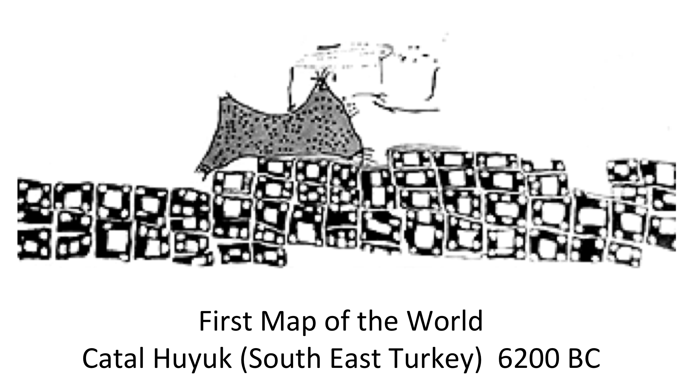

Introduction to Web Services
============================

Maps and the web
----------------
The first map of the world was probably created 6,200 BC in what today is South East Turkey.

We evolve from making maps in caverns, to making maps in rocks, wood, paper and finally electronically. Maps now days are created on demand, most of the times using mobile phones.

.. image:: ../img/mobile-map.jpg
      :width: 70%  

The World Wide Web or Web, refers to all the interlinked information from computers in the Internet. Internet is a network of connected computers that 
enable computers to talk each other using protocols like TCP/IP. Billions of computers and devices are connected today to the Internet.
Each of these devices can be distinguished uniquely from each other via  URL.

URL
---
The Uniform Resource Locator or hyperlink is a string that provides a reference to a resource on the Web. A Web resource can be anything: a page, file, image, or as previously saw a HTTP GET request. Some examples are as follows:

- http://www.opengeospatial.org
- ftp://ftp.funet.fi/pub/standards/RFC/rfc959.txt
- Mailto: bermud@me.com

The first identifies and reference to OGC. The second is a reference identifying a document,  and the third identifies the email address of a person.

Encodings
---------
Encodings provide the format and syntax of the messages, or data send to and by the server. 
Messages are file or a data streams.  For example text encoding standards are based on UTF-8, 
XML and ASCII. The format identifies and determines what type of computer program can be use to read 
or interact with the file or data stream. For example:
   
   - A file in XML ** ** requires a program that can read and write XML.
   - An image in JPG ** ** requires a program that can read and write images to JPG.
   - A temporary binary object ** ** JAVA, requires a Java program that can understand this object.

Web Services defines interfaces and operations that allow the exchange of information with certain encodings.

HTTP
----
World Wide Web Consortium (W3C) defines protocols for exchanging information on the Web. OGC relies on W3C protocols 
to develop interfaces for Geospatial Web Services. The two most common ones are as follows:

HTTP GET
^^^^^^^^

The HTTP GET (hereafter GET) method is used to requests a representation of a specified resource via a URL. The request takes the form of:

.. code-block:: properties

	http://www.example.com/wfsserver?
		name1=value1&
		name2=value2&

The above request sends  the key/value pairs of *name1=value1* and *name2=value2* to the server located at  http://www.example.com/wfsserver. The allowed names and values refer to server-specific settings. A fair amount a data can be passed through a GET request, as there is no official limit to the length of a URL. But sending too much data through a GET request can become unwieldy, not to mention rather hard to read. The pro side of a GET request is that it is very compact, and can be sent via a Web browser. 

HTTP POST
^^^^^^^^^

HTTP POST involves submission of data to be processed (usually from an HTML form).

POST requests involves custom clients and sending of XML encoded data to a server. It is more verbose than HTTP GET. Every GET request here has an equivalent POST request, but the opposite is not true.
The following example provides an HTTP request represented as a URL (HTTP GET):

    http://localhost:8080/geoserver/wfs?request=GetCapabilities&VERSION=1.0.0&SERVICE=WFS

Same request as an XML (HTTP POST).

.. code-block:: xml

   <?xml version="1.0"?>
      <wfs:GetCapabilities
      service="WFS"
      version="1.0.0"

      xmlns:wfs="http://www.opengis.net/wfs"
      xmlns:xsi="http://www.w3.org/2001/XMLSchema-instance"
      xsi:schemaLocation="http://www.opengis.net/wfs http://schemas.opengis.net
         wfs/1.0.0/WFS-basic.xsd"
   />  

Service, Interface and Operations
---------------------------------
It is important to distinguish between service interfaces and operations, 
as many of OGC standards are based on these concepts.

Service
^^^^^^^

A Service is a set of interfaces provided by an entity. The service provides a 
functionality that distinguishes the entity from other entities [ISO19119]_. 
In this context, an entity is a server on the web,
that provides a service, in most cases via HTTP.

Interface
^^^^^^^^^
An interface specifies a set of calls to an object (i.e. server) to execute a process 
(e.g., transformation or query). Usually it defines the name of the operations, 
the list of parameters and allowed values. 

Operation
^^^^^^^^^

In the context of Web services, an operation is a request to a server. For example, 
an HTTP GET request. An operation is define by a service interface.

Vacuum Cleaning Robot Analogy
^^^^^^^^^^^^^^^^^^^^^^^^^^^^^

If we look at a vacuum cleaning robot, will see it provides a service, 
with a set of interfaces and a set of operations.

.. image:: ../img/roomba-service.jpg
   :width: 50%  

We can depict the following:   

Service
   The robot provides the functionality to clean a room, via a set of interfaces.
   
Interface
   The robot provides two interfaces: 1) to select the room, 2) an electric interface.  
   
Operation
   The interface room selection provides three operations to set how the robot will move around a room:
      
      1. S: Small room
      2. M: Medium room
      3. L: Large room 

In an OGC Web Service
^^^^^^^^^^^^^^^^^^^^^

A WFS service is a service that provides the functionality to retrieve features. For example if we were interested in data about points of interest, each point of interest  can have a  location,  name and other properties. 

We can depict the following:   

Service
   WFS 1.1
   
Interface
   Two types:
      - Basic
      - Transaction
   
Operations
   For the Basic Interface:
      - GetFeature
      - DescribeFeature

