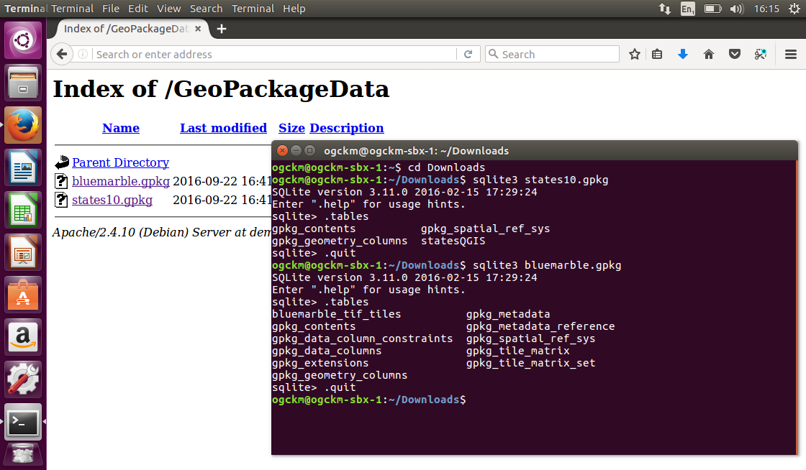

GeoPackage - Introduction
=========================

Introduction
------------

The GeoPackage Encoding Standard describes a set of rules and conventions for storing vector features, imagery tile matrix sets, raster map tile matrix sets and non-spatial tabular data in an SQLite database. The standard also describes rules for extending the capabilities of a GeoPackage.

History
  GeoPackage 1.0 was approved as a standard in January 2014.
  GeoPackage 1.1 was approved as a standard in August 2015.
  GeoPackage 1.2 was approved as a standard in August 2017.
Versions
  1.2 is the current latest version
Test Suite
  A test suite exist in the `OGC repository. <https://github.com/opengeospatial/ets-gpkg12>`_

Usage
-----

GeoPackage is used for storing and accessing:

* Vector feature data
* Imagery tile matrix sets
* Raster map tile matrix sets
* non-spatial tabular data
* Metadata that describes other stored data

Relation to other OGC Standards
-------------------------------

Due to being serialized in XML, GML is well suited to geospatial data exchange across networks.
In contrast, GeoPackage is better suited to storage and random access of geospatial data on a file system.
GeoPackage implements the OGC OpenGIS® Simple Features Interface Standard (SFS) which provides a common way for applications to store and access feature data in relational or object-relational databases.

Example
-------

Let's have a look at two example of GeoPackage files. Both files can be downloaded from `this website <https://demo.luciad.com/GeoPackageData/>`_. The files include:

* states10.gpkg which contains vector feature data of US states and their attributes
* bluemarble.gpkg which contains tile matrix sets of imagery.

To have a look at the structure of the files, download the files and open them using the basic SQLite3 command-line utility.

* on Windows SQLite3 has to be downloaded and installed from `here <https://sqlite.org/download.html>`_.
* on Ubuntu/Debian SQLite3 has to be installed using ``sudo apt-get install sqlite3`` or downloaded from `here <https://sqlite.org/download.html>`_.
* on Mac OS X, SQLite3 is pre-installed on newer versions and can be opened from the Terminal application  or downloaded from `here <https://sqlite.org/download.html>`_.

First run the following command ``sqlite3 states10.gpkg`` from the terminal to open the states10.gpkg GeoPackage.

Once the SQLite3 application is running, list the tables in the GeoPackage using the following command ``.tables``. Notice that the names of tables contained in the database are listed.

Now close the SQLite3 application by running the following command ``.quit``

Next, run the following command ``sqlite3 bluemarble.gpkg`` from the terminal to open the bluemarble.gpkg GeoPackage.

Once the SQLite3 application is running, list the tables in the GeoPackage using the following command ``.tables``. Notice that the tables are different from those that are in the states10.gpkg GeoPackage. This is because the states10.gpkg file contains vector features only, whereas the bluemarble.gpkg file contains tile matrix sets of imagery.

Now close the SQLite3 application by running the following command ``.quit``

A screenshot showing the steps and outputs is presented below.

Most of the tables are optional and only required for specific types of datasets. That is why the bluemarble.gpkg database has some tables that are not in the states10.gpkg database. The following figure shows the mandatory and optional tables of a GeoPackage.

.. image:: ../img/geopackage-overview.png
   :height: 327
   :width: 560

Although the SQLite3 command line utility can list tables contained in a GeoPackage and query non-spatial attributes, SQLite3 is unable to read the geospatial content. A GeoPackage reader is required to view and query both the spatial and non-spatial content together. The OGC `website <http://www.opengeospatial.org/resource/products/byspec>`_ contains a list of software applications that offer GeoPackage reading and writing.

Using the free and open source QGIS application, open the states10.gpkg file, through the vector file loader button.

.. image:: ../img/open_states10.png
   :height: 327
   :width: 560

Once QGIS has loaded the GeoPackage, it will display US state boundaries. As a GeoPackage reader, QGIS is able to read the geometries, spatial reference system and other geospatial content.

.. image:: ../img/view_states10.png
   :height: 327
   :width: 560

Now we will have a look at the feature properties. Right click on the layer name (which is displayed as statesQGIS) and select Open Attribute Table from the pop-up menu.

.. image:: ../img/open_attribute_table.png
   :height: 327
   :width: 560

The properties of all features in the statesGIS dataset are displayed in an attribute table. The data can now be queried and modified like any other feature dataset in a desktop GIS.

.. image:: ../img/view_attribute_table.png
   :height: 327
   :width: 560

Details:

- Implemented in an SQLite database
- Feature geometry is encoded in Well Known Text (WKT) based on the OGC OpenGIS® Simple Features Interface Standard (SFS)
- Supports both vector feature data and tile matrix sets of imagery and maps
- Ideal format for encoding geospatial data where Size, Weight and Power (SWaP) are limited

External links
--------------

The GeoPackage.org information `website <http://www.geopackage.org>`_ contains additional information and sample GeoPackage files.
