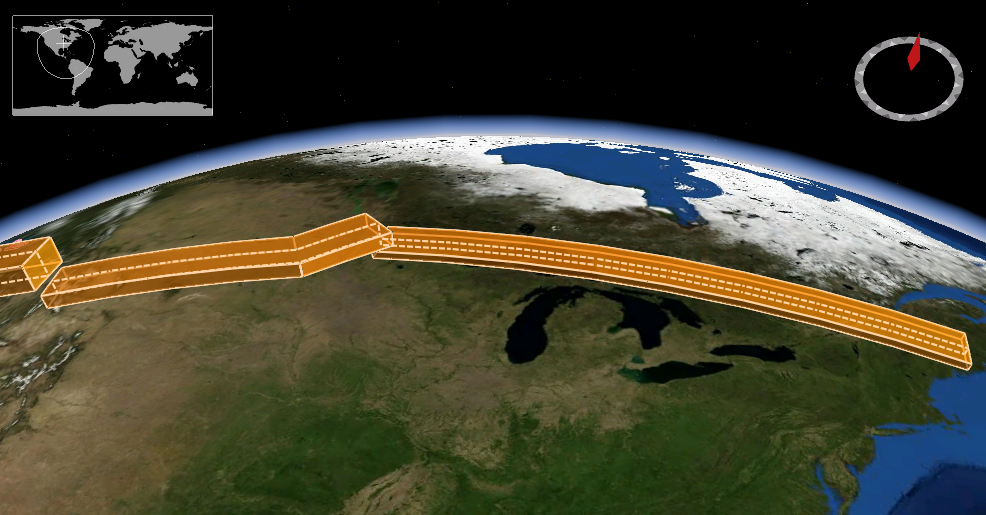

Corridor Query Resources of OGC API - EDR
================

A corridor is a two parameter set of points around a trajectory. An illustration is shown below.

The `corridor` query resource returns data for the defined corridor. The resource offers a convenience mechanism for querying the API by corridor, using a Well Known Text (WKT) LINESTRING geometry, or alternatively subclasses LINESTRINGZ, LINESTRINGM, LINESTRINGZM.

The path to the resource is shown below:

`/collections/{collectionId}/corridor`

The paths accepts the following parameters:

- coords
- corridor-width
- corridor-height
- width-units
- height-units
- z
- parameter-name
- datetime
- crs
- f
