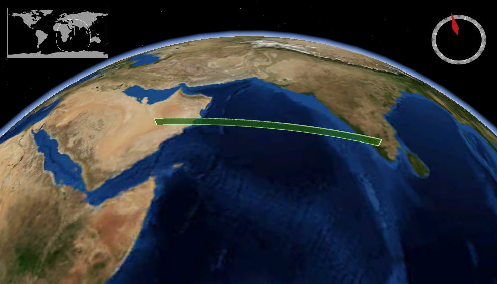

Trajectory Query Resources of OGC API - EDR
================

A trajectory is a path of a moving point described by a one parameter set of points. An illustration, created using NASA WorldWind, is shown below.

The `trajectory` query resource returns data for the defined trajectory. The resource offers a convenience mechanism for querying the API by trajectory, using a Well Known Text (WKT) LINESTRING geometry, or alternatively the specializations LINESTRINGZ, LINESTRINGM, LINESTRINGZM.

The path to the resource is shown below:

`/collections/{collectionId}/trajectory`

The paths accepts the following parameters:

- coords
- z
- parameter-name
- datetime
- crs
- f

An example request is shown below.

`http://example.org/edr/collections/gfs-pressure_at_height/trajectory?coords=LINESTRING(-3.56 53.695,-3.546 53.696,-3.532 53.697)&parameter-name=Height&crs=CRS84&f=CoverageJSON`
